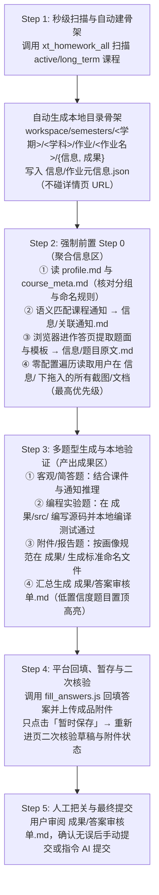

# 学习通个人学业工作台 (Xuexitong Academic Workbench)

**学习通个人学业工作台**是一个面向高校学生的本地化 AI 学业辅助系统。它通过 **“双层用户画像（Global Profile + Course Meta）”** 与 **“本地全中文分层数据仓库（`workspace/`）”**，将 **`chaoxing-mcp`（直连 HTTP 极速扫描服务）** 与 **`xuexitong-skill`（浏览器自动化与多模态作答技能）** 融合，打造出从“作业巡检通知、多源题目信息聚合、本地代码编译验证”到“草稿暂存与人工审核”的完整闭环。节省您的宝贵时间！

> **核心设计哲学：AI 负责体力活与打草稿，提交权永远在人。**
> 本系统严格执行“只暂存、绝不自动提交”与“列表扫描零误触详情页”等安全红线，所有個人数据与凭证均隔离在本地（Git 忽略保护）。

---

## 一、项目目的：为什么需要这个工作台？

很简单，懒！

懒得总是到学习通上面翻各种信息，而且各种信息很杂乱，有时作业和通知是联系再一起的，作业的详细要求是以通知的形式发送的，总之就是翻来翻去很烦，而且dddd（懂得都懂），基本上是ai辅助完成作业，要收集各种零散的作业信息和要求也很烦不是吗（坏笑）每次都要写一长串提示词很烦不是吗？

所以从收集信息到完成作业甚至到提交作业直接ai一把梭哈了！当然，我不建议真的所有作业都一点不写，变成废人了。总之自己衡量，哪些水水过了，哪些需要自己好好看看。

### 七条纪律红线


| 编号  | 红线规则                 | 说明                                                                                                                        |
| :------ | :------------------------- | :---------------------------------------------------------------------------------------------------------------------------- |
| **1** | **绝不自动提交**         | 作业与测验只允许点击“暂时保存”；仅当用户审阅后明确下达“提交”指令才点提交。                                              |
| **2** | **列表扫描不碰详情页**   | 日常扫描作业列表时**绝不请求** `work/task` 详情页 URL，严防触发平台为未开始作业（`answerId=0`）提前分配答题记录或开启计时。 |
| **3** | **绝不进入正式考试**     | 有监考、限时或防作弊机制的正式考试不进入、不看题、不作答，仅支持查询考试时间与状态。                                        |
| **4** | **不伪造签到证据**       | 签到默认只检测与提醒；绝不自动生成或伪造照片、GPS 坐标、二维码`enc` 或猜签到码。                                            |
| **5** | **视频挂机默认关闭**     | 仅当用户当场明确要求时才在真实浏览器按 1 倍速播放，绝不伪造协议或篡改倍速上报。                                             |
| **6** | **关键操作二次进页核验** | 暂存草稿、上传附件后必须重新进入作答页核对内容与附件是否真正持久化保留。                                                    |
| **7** | **隐私与凭证安全**       | 账号密码（`.env`）、会话（`cookies.json`）与个人学业仓库（`workspace/`）全部受 `.gitignore` 保护，绝不入库。                |

---

## 二、运行原理与基本流程

### 1. 运行原理：双擎驱动 + 本地数据中心

工作台由三个核心层次协同运作：

```text
                       ┌──────────────────────────────────────────┐
                       │          AI Agent (自然语言交互)          │
                       └───────────┬──────────────────┬───────────┘
                                   │                  │
            ① 高频只读查询     │                  │ ③ 复杂交互与多模态作答
            (查课表/扫作业/改状态)   ▼                  ▼ (提题/解加密字/传附件/暂存)
                       ┌───────────────────┐  ┌───────────────────┐
                       │   chaoxing-mcp    │  │  xuexitong-skill  │
                       │ (纯 Python HTTP)  │  │ (Playwright 浏览器)│
                       └─────────┬─────────┘  └─────────┬─────────┘
                                 │                      │
                 AES-CBC 自动登录 │                      │ 跨域 iframe 穿透 + JS 注入
                 Cookie 本地持久化│                      │ 真实浏览器会话复用
                                 ▼                      ▼
                       ┌──────────────────────────────────────────┐
                       │       学习通服务器 (i.chaoxing.com)       │
                       └──────────────────────────────────────────┘
                                           ▲
                                           │ ② 读写双层画像 & 落地「信息/成果」
                                           ▼
                       ┌──────────────────────────────────────────┐
                       │     本地分层数据仓库 (./workspace/)       │
                       │  profile.md | courses_index.json | 学期树 │
                       └──────────────────────────────────────────┘
```

1. **极速直连层（`chaoxing-mcp`）**：
   - 内置学习通网页端登录逆向逻辑（`AES-CBC` 加密手机号与密码，Key/IV 为 `u2oh6Vu^HWe4_AES`），登录成功后将 Cookie 持久化至 `chaoxing-mcp/cookies.json`，掉线自动静默重登。
   - 利用每门课固定的防爬签名参数（`stuenc` + `work_enc`，缓存于 `workspace/courses_index.json`），无需启动浏览器即可并发拉取课程与作业列表，并自动在本地生成目录骨架。
2. **浏览器自动化与技能层（`xuexitong-skill`）**：
   - 针对学习通复杂的**跨域多层 iframe 结构**（如 `#frame_content`、`#frame_content-zy`），提供经过真机校准的导航地图与前端注入脚本（`extract_questions.js`、`fill_answers.js` 等）。
   - 处理必须依赖浏览器的重度交互：解析 `font-cxsecret` 加密字体、多模态识别数学公式图片、按选项字母/文本精准点击（规避平台重做时随机化 `data` 属性）、操作 UEditor 富文本编辑器（`setContent + sync`）、大文件分块注入上传以及点击“暂时保存”。
3. **本地状态与画像层（`workspace/`）**：
   - 彻底告别无状态临时目录，以全中文直观目录树沉淀所有学业资产，实现“人机共管”——AI 自动建好目录并拉取线上数据，用户在 Finder/编辑器中直接拖入补充材料或检视成果。

---

### 2. 基本工作流程（五步闭环）



---

## 三、目录结构详解：各个文件夹的用处与使用方法

项目根目录将**工具源码**与**个人学业数据**严格解耦：

```text
xuexitong-academic-workbench/
├── .env.example                # 环境变量配置模板（复制为 .env 使用）
├── .env                        # 本地账号密码与工作区路径配置（Git 忽略，绝不入库）
├── SPEC.md                     # 产品规格说明书、架构设计与测试契约蓝图
├── README.md                   # 项目详细说明文档（本文档）
├── .agents/                    # Agent 客户端本地挂载配置（MCP 注册与技能链接）
├── chaoxing-mcp/               # 核心组件 1：学习通 HTTP 直连 MCP 服务端与离线测试套件
├── xuexitong-skill/            # 核心组件 2：学习通浏览器自动化 AI 技能包主源
└── workspace/                  # 核心组件 3：本地个人学业数据仓库（Git 忽略，绝不入库）
```

下面逐一说明每个文件夹的**具体作用**与**使用方法**：

---

### 1. `workspace/` —— 本地个人学业数据仓库（日常打交道最多的地方）

这是你的个人学业数据中心，采用**全中文分层结构**，你可以直接在 macOS Finder 或 VS Code / Cursor 等编辑器中打开浏览、拖放文件。

```text
workspace/
├── profile.md                        # 【全局学生画像】姓名、学号、专业班级、入学年月、开发环境偏好
├── courses_index.json                # 【课程三态索引】维护所有课程的学期归属、status 状态及 stuenc/work_enc 签名
└── semesters/                        # 【按学期归档树】例如 2025-2026-1、2025-2026-2、2026-2027-1
    └── 2026-2027-1/                  # 当前学期目录（由入学年月与当前日期自动推算）
        └── 数据结构/                  # <学科名称>
            ├── course_meta.md        # 【学科级画像】任课教师、所在分组号(group)、附件命名规则、特殊要求
            ├── 通知/                 # 【课程通知】同步归档的本课程通知 Markdown
            ├── 资料/                 # 【课程课件】从学习通下载的 PPT/PDF 课件及提取的知识点笔记
            └── 作业/                 # 【作业批次目录】每次扫描发现作业时自动建好同名文件夹
                └── 上机实验1-简易向量/
                    ├── 信息/         # 👈 输入区（线上拉取题面 + 你随手拖入的补充材料）
                    │   ├── 作业元信息.json   # 列表扫描时自动写入（workId, answerId, 状态, 剩余时间, 详情链接）
                    │   ├── 题目原文.md       # 作答时从页面拉取的完整题干、选项、公式转录
                    │   ├── 关联通知.md       # AI 从「通知/」中语义筛选出的本作业补充要求
                    │   └── 黑板板书.jpg      # 💡 你随手拖入的课堂照片/微信截图/Excel模板（无需改名！）
                    └── 成果/         # 👉 输出区（AI 产出的审核单、可运行源码与待上传成品）
                        ├── 答案审核单.md     # 必有：低置信度置顶提示 + 逐题答案/依据/测试结果 + 暂存核验状态
                        ├── src/              # 编程/实验题源码、测试数据与本地验证脚本
                        └── 2025xxxx_姓名_上机实验1-简易向量.docx  # 按画像自动命名的待上传成品文件
```

#### 💡 怎么用 `workspace/`？

1. **维护全局画像（`workspace/profile.md`）**：
   - 首次使用时打开 `workspace/profile.md`，在顶部 YAML 区域填好你的真实 `name`（姓名）、`student_id`（学号）、`major_class`（专业班级）、`enrollment`（入学年月，如 `"2025-09"`）和 `attachment_naming_default`（默认附件命名模板）。
   - `current_semester: "auto"` 会根据你的入学年月和当前月份自动计算出当前学期（9 月~次年 1 月为秋冬学期 `-1`，2 月~8 月为春夏学期 `-2`）。
2. **定制学科规则（`<学科>/course_meta.md`）**：
   - 当某门课有**小组作业**（例如你在“第 1~10 组”）或老师规定了特殊的**实验报告命名格式**（例如 `{student_id}-{name}-实验{num}.pdf`）时，打开对应学科下的 `course_meta.md` 修改 `group` 或 `naming_rule` 字段。AI 扫描和作答时会自动遵守。
3. **往 `信息/` 文件夹里随手丢补充材料**：
   - 老师在课堂黑板上写了作业补充要求？或者微信群发了勘误截图？直接打开 Finder，把照片（`.jpg/.png`）、文档或模板拖进对应作业的 `信息/` 目录下，**不需要改成固定文件名**。AI 在作答 Step 0 时会强制遍历读取 `信息/` 下的所有文件，并将其视为**最高优先级指令**。
4. **在 `成果/` 文件夹里验收 AI 的工作**：
   - AI 完成作答并暂存后，打开 `成果/答案审核单.md` 即可一目了然地查看每道题的答案、课件出处、置信度以及 `成果/src/` 下代码的本地编译运行结果。

---

### 2. `chaoxing-mcp/` —— 学习通直连 HTTP MCP 服务端

提供零浏览器开销、毫秒级响应的标准 MCP（Model Context Protocol）服务，以及保障核心逻辑可靠的离线自动化测试套件。

```text
chaoxing-mcp/
├── server.py               # 单文件纯 Python MCP 服务端（JSON-RPC 2.0 over stdio）
├── test_server.py          # 基于顶层 handle(req) 边界的离线集成测试套件
├── requirements.txt        # Python 依赖声明（requests, pycryptodome）
├── cookies.json            # 自动持久化的学习通登录 Cookie（Git 忽略）
├── enc_map.json            # 旧版签名缓存兼容文件（已自动迁移并桥接至 workspace/courses_index.json）
├── AGENTS.md               # 供 AI 助手阅读的自动化安装与排障指南
└── README.md               # MCP 模块独立说明
```

#### 💡 提供了哪些 MCP 工具？怎么用？

日常你在对话中用自然语言提问，AI 会自动调用以下 MCP 工具（你也可以在指令中直接点名调用）：


| MCP 工具名             | 核心功能与作用                                                                                           | 关键参数说明                                                                                               |
| :----------------------- | :--------------------------------------------------------------------------------------------------------- | :----------------------------------------------------------------------------------------------------------- |
| **`xt_homework_all`**  | **秒级扫描本学期未交作业**，并在 `workspace/semesters/` 下自动创建目录骨架与 `作业元信息.json`。         | `include_archived` (默认 `false`，只扫 `active` 与 `long_term` 课程)；`semester` (可选，按学期过滤)        |
| **`xt_homework`**      | 查询**单门指定课程**的所有作业列表（状态、剩余时间、详情 URL）并建立该课本地作业目录骨架。               | `course`: 课程名称关键词（如 `"数据结构"`）或 `courseId`                                                   |
| **`xt_courses`**       | 列出当前在修（`active`）与长线（`long_term`）课程，展示所属学期、状态及是否已配置 `[enc]`。              | `include_archived`: 传 `true` 可查看包含已结课归档在内的全部历史课程                                       |
| **`xt_course_status`** | 一键修改某门课的生命周期状态（如将已结课的小学期课程归档）或调整所属学期，持久化至`courses_index.json`。 | `course`: 课程名或 ID；`status`: `"active"` / `"long_term"` / `"archived"`；`semester`: 如 `"2026-2027-1"` |
| **`xt_seed_enc`**      | 为新开课程一次性写入`stuenc` 与 `work_enc` 签名参数（写入后永久可直连扫描）。                            | `course_id`, `stuenc`, `work_enc`                                                                          |
| **`xt_page_text`**     | 携带持久化登录态直接拉取任意学习通 URL 的清洗后纯文本内容。                                              | `url`: 目标页面链接                                                                                        |
| **`xt_login`**         | 执行 AES-CBC 加密登录并刷新`cookies.json`（其他工具发现会话过期时会自动调用，一般无需手动触发）。        | 无参数（自动从`.env` 读取账号密码）                                                                        |

---

### 3. `xuexitong-skill/` —— 学习通全能 AI 技能包

遵循 Agent Skills 规范编写的领域知识库与浏览器脚本集，指导 AI 如何正确操控浏览器完成复杂任务、避开学习通前端的各类反爬与渲染陷阱。

```text
xuexitong-skill/
└── skills/xuexitong/
    ├── SKILL.md                    # 技能总入口：纪律红线、目录契约、意图路由表与主流程
    ├── references/                 # 按场景拆分的深度操作手册（AI 按需加载，避免撑爆上下文）
    │   ├── homework.md             # 作业与测验全流程手册（Step 0 聚合、多题型产出、审核单模板、回填核验）
    │   ├── login-and-nav.md        # 登录检测与跨域 iframe 导航地图（#frame_content 跳转规范）
    │   ├── browser-adapters.md     # Playwright MCP / chrome-devtools / browser-use 动作映射表
    │   ├── download.md             # 课件 PPT/PDF 直链提取（绕过无下载按钮限制）与知识点归档至「资料/」
    │   ├── info.md                 # 课程通知同步（归档至「通知/」）、成绩、章节进度与考试时间查询
    │   ├── answer-sources.md       # 用户自备本地答案文件或自建题库接口的接入规范
    │   ├── pitfalls.md             # 29 条实战踩坑速查表（加密字体、UEditor 同步、防空白页等）
    │   ├── tasks.md                # 【灰色/默认关闭】视频任务点真实浏览器 1x 播放规范
    │   └── signin.md               # 【灰色/默认关闭】签到检测提醒与用户自备证据代交边界
    └── scripts/                    # 经真机验证的浏览器端注入脚本（供 AI 在页面 evaluate 调用）
        ├── extract_questions.js    # 提取作答页完整题目、选项、填空框、公式图片与加密字体标记
        ├── fill_answers.js         # 按选项字母/文本回填单选/多选/判断/填空与 UEditor 简答题
        ├── list_courses.js         # 浏览器端提取课程清单备用脚本
        ├── list_works.js           # 浏览器端提取作业列表备用脚本
        └── answer_source.js        # 外部答案源匹配辅助脚本
```

#### 💡 怎么用 `xuexitong-skill/`？

- **自动触发**：该目录已通过软链接挂载至 [`.agents/skills/xuexitong`](.agents/skills/xuexitong)。当你在对话中提到“学习通、查作业、写作业、交作业、下载课件、查通知、章节测验”等关键词时，AI 会自动加载 [`SKILL.md`](xuexitong-skill/skills/xuexitong/SKILL.md) 并按路由表读取对应的 `references/*.md` 和 `scripts/*.js`。
- **定制与扩展**：如果你发现某类新题型或学习通页面改版，可以直接编辑 `xuexitong-skill/skills/xuexitong/references/` 下的对应文档或 `scripts/` 下的 JS 脚本，因为单一主源软链接机制，修改会立即对 AI 生效。

---

### 4. `.agents/` 与根目录配置文件

- **[`.env.example`](.env.example) & `.env`**：
  - 存放 `XT_PHONE`（学习通手机号）、`XT_PASSWORD`（学习通密码）和 `XT_WORKSPACE_DIR`（工作区路径，默认 `./workspace`）。
- **[`.agents/mcp_config.json`](.agents/mcp_config.json)**：
  - 注册了两个核心 MCP 服务：`xt`（指向 `./chaoxing-mcp/server.py`）和 `playwright`（用于浏览器自动化操作）。
- **[`SPEC.md`](SPEC.md)**：
  - 详细记录了本工作台的产品背景、25 条用户故事（User Stories）、架构决策与离线测试边界，适合开发者或想深入了解系统设计细节的用户阅读。

---

## 四、快速开始（配置与自检）

### 1. 配置账号环境变量

在项目根目录下复制环境变量模板并填入你的学习通账号密码：

```bash
cp .env.example .env
```

编辑 `.env` 文件：

```dotenv
XT_PHONE=你的学习通绑定手机号
XT_PASSWORD=你的学习通密码
XT_WORKSPACE_DIR=./workspace
```

### 2. 完善个人全局画像

打开 `workspace/profile.md`，确认或填写你的姓名、学号、专业班级、入学年月（如 `2025-09`）及常用的编程语言工具链偏好。

### 3. 运行离线集成测试套件（验证环境完好）

项目自带不依赖外网和真实密码的毫秒级离线测试套件（覆盖学期自动推算、三态课程过滤、骨架自动生成及零详情页误触红线）：

```bash
./chaoxing-mcp/.venv/bin/python -m unittest discover -s chaoxing-mcp -v
```

看到 `OK` 即表示 MCP 服务端与工作区契约一切正常。

---

## 五、实用案例（直接对 AI 说这些话）

配置完成后，你只需要在当前项目中像和助教聊天一样对 AI 下达指令。以下是 5 个最常用的实战案例：

### 案例 1：日常查作业（自动过滤结课课程与非本组作业）

> **你对 AI 说**：
> “帮我看看这学期还有哪些作业没交？按截止时间排个序。”

**工作台背后发生的事**：

1. AI 调用 `xt_homework_all()`，读取 `workspace/profile.md` 推算当前学期为 `2026-2027-1`，并只扫描 `workspace/courses_index.json` 中状态为 `active`（本学期在修）和 `long_term`（如形势与政策）的课程，自动跳过 20 多门 `archived` 历史课程。
2. 返回各科作业列表，同时自动在 `workspace/semesters/2026-2027-1/<学科>/作业/<作业名>/` 下创建好 `信息/` 与 `成果/` 文件夹及 `信息/作业元信息.json`（全程不触碰未开始作业的详情页）。
3. AI 检查对应学科的 `course_meta.md`，若发现某未交项属于其他小组，会在汇报中贴心标注“非本组（无需提交）”，并把真正需要你处理的待办按剩余时间升序展示。

---

### 案例 2：结合课堂黑板照片 + 课程通知，完成 C++ 编程实验作业

> **场景**：《数据结构》布置了“上机实验1-简易向量”，老师在课堂黑板上写了额外的边界测试要求，你拍了张照片 `board.jpg`。**你的操作**：
>
> 1. 打开 Finder，把 `board.jpg` 拖进 `workspace/semesters/2026-2027-1/数据结构/作业/上机实验1-简易向量/信息/` 目录下。
> 2. **对 AI 说**：“帮我做一下《数据结构》的‘上机实验1-简易向量’，我已经把课堂板书拍下来放进信息文件夹了，写完代码在本地编译测试通过后帮我暂存到学习通。”

**工作台背后发生的事**：

1. **强制前置 Step 0**：
   - AI 读取 `workspace/profile.md`（获知你在 macOS 下偏好 `clang++ -std=c++17`）和 `数据结构/course_meta.md`（获知附件命名规则）。
   - 检查 `数据结构/通知/`，将相关通知摘录至 `信息/关联通知.md`。
   - 用浏览器打开该作业作答页，提取题面与附件模板存入 `信息/题目原文.md`。
   - **自动发现并调用多模态视觉识别你拖入的 `信息/board.jpg`**，将黑板上的额外要求作为最高优先级约束。
2. **本地编码与编译验证**：
   - AI 在 `成果/src/` 下编写 C++ 源码与单元测试脚本，直接调用本机 `clang++` 编译并运行测试，直到所有测试用例通过。
3. **生成审核单与平台暂存**：
   - 在 `成果/` 下生成按规范命名的实验报告/源码包与 `成果/答案审核单.md`（内含完整测试输出）。
   - 在浏览器中回填内容并上传成品文件，**只点击“暂时保存”**，随后重新进页二次核验草稿确实存在，最后向你汇报请予检视。

---

### 案例 3：做带 Excel / Word 附件模板的作业并自动按学号姓名命名

> **你对 AI 说**：
> “把《数据结构》的‘复习2-C++函数及运算符重载.xls’做一下，填好表格后按课程规范命名并上传暂存。”

**工作台背后发生的事**：

1. AI 进入作答页，将老师在题目中挂出的原始 `.xls` 模板下载到 `作业/复习2-C++函数及运算符重载.xls/信息/` 目录（原始模板永久保留在 `信息/` 中不破坏）。
2. AI 解析表格中的题目，结合 `数据结构/资料/` 下的课件内容逐题作答。
3. AI 读取 `profile.md` 与 `course_meta.md` 中的 `naming_rule`（如 `{student_id}_{name}_{homework_title}.xls`），在 **`成果/`** 目录下生成填好答案的成品表格文件，同时输出 `成果/答案审核单.md`（把拿不准的题目置顶标黄提醒你重点看）。
4. 将 `成果/` 下的成品文件上传至学习通作答框，点击“暂时保存”并二次进页确认附件无误。

---

### 案例 4：管理课程状态（归档已结课课程 / 为新开课程补种 `enc`）

> **场景 A（归档老课）**：某门小学期课程（如《人工智能导论》）老师在平台上一直没点结课，你不想每次查作业都看到它。
> **你对 AI 说**：“把《人工智能导论》设为归档状态。”
> **效果**：AI 调用 `xt_course_status(course="人工智能导论", status="archived")`，更新 `workspace/courses_index.json`，从此日常扫描不再受其干扰（需要查历史时说一句“包含归档课程扫一下”即可随时找回）。

> **场景 B（新学期新课补种）**：新学期刚选了一门新课，或者 `xt_courses` 提示某门在修课显示 `[no-enc]`。
> **你对 AI 说**：“帮我检查一下有没有缺 `enc` 的在修课，有的话用浏览器补种一下。”
> **效果**：AI 调用 `xt_courses()` 定位缺失签名的课程 → 自动用浏览器登录并点进该课的“作业”标签 → 从 `#frame_content-zy` 的 `src` 中提取 `stuenc` 和 `enc` → 调用 `xt_seed_enc` 写入 `workspace/courses_index.json`。只需一次，后续整个学期该课均可 0.3 秒直连扫描。

---

### 案例 5：批量下载课程 PPT 课件到本地 `资料/` 并用于辅助答题

> **你对 AI 说**：
> “把《概率论与数理统计A》这学期的课件 PPT 全部下载下来，整理到它的资料文件夹里，并同步一下这门课的最新通知。”

**工作台背后发生的事**：

1. 即使学习通页面上老师隐藏了课件的“下载”按钮，AI 也会按照 `references/download.md` 通过接口拿到 CDN 直链，将课件下载并提取文本笔记归档至 `workspace/semesters/2026-2027-1/概率论与数理统计A/资料/`。
2. 同步课程通知至 `workspace/semesters/2026-2027-1/概率论与数理统计A/通知/`。
3. 之后当你让 AI 做《概率论与数理统计A》的作业时，AI 会直接检索 `资料/` 下的官方课件原话作为答题依据，并在 `答案审核单.md` 中注明“依据第 X 章课件第 Y 页”，大幅提升准确率。

---

## 六、常见问题与排障指南

1. **提示 `no account: configure XT_PHONE and XT_PASSWORD`？**
   - 请检查项目根目录下是否已创建 `.env` 文件，且里面的 `XT_PHONE` 和 `XT_PASSWORD` 填写正确。
2. **某门课在 `xt_homework_all` 中没有被扫描到？**
   - 对 AI 说：“列出我的所有课程（含归档）”，检查该课在 `workspace/courses_index.json` 中是否被标为了 `archived`，或者是否显示 `[no-enc]`。若是前者，让 AI 改为 `active`；若是后者，让 AI 用浏览器进一次该课作业页补种 `enc`。
3. **作答页遇到乱码文字或空白公式？**
   - 学习通部分题目启用了 `font-cxsecret` 加密字体或将数学公式渲染成了图片。`xuexitong-skill` 的 `extract_questions.js` 会自动检测 `hasSecretFont` 与 `stemImgs`，AI 会自动截图并使用多模态视觉执行“看想分离”读题（先纯转录文字/公式，再答题）。
4. **想自己修改某道题的答案再提交怎么办？**
   - 因为工作台**只点暂时保存**，你可以先看 `成果/答案审核单.md`，然后直接在学习通网页草稿里修改那道题的选项，或者直接告诉 AI：“把第 3 题改成 C 重新暂存一下”，核对满意后再点提交。

---

## 七、免责声明与开源许可

- 本项目**仅供个人学习交流、本地学业管理与技术研究使用**，与超星学习通官方无任何关联。
- 请严格遵守所在高校的学术诚信规定与《学习通用户协议》。AI 生成的答案与代码仅供复习参考与草稿辅助，**请务必通过 `成果/答案审核单.md` 亲自审核理解后再行提交**。
- 本项目基于 [MIT License](chaoxing-mcp/LICENSE) 开源。
- 感谢[github.com/Han-maker-wp/xuexitong-skill](https://github.com/Han-maker-wp/xuexitong-skill)，本项目从该项目修改而来。
